# About me.
Eletronic engineering at UnB, Brazil.
Building a portfolio focused on RF engineering and high frequency PCBs based on oportunities presented to me primaraly during my participation in the Telecommunications Lab(<a href="https://lab-telecom.unb.br/">LabTelecom</a>)in UnB. I have fundamentals in VNA analyzers, experience with PCB manufacturing with fiber laser engravers, with line followers and related eletronics(Titans competition team), with eletromagnetic rf circuit simulation in Ansys softwares.

# A couple of things that i worked on: 

## ESP32 with Dual USB-C Ports

This project is an **ESP32 design** created with **Altium**.
The images below show some of the schematics/3D models of the board.

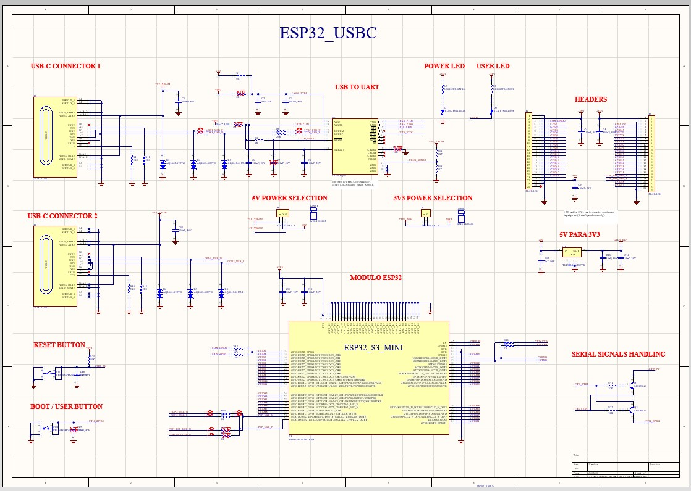
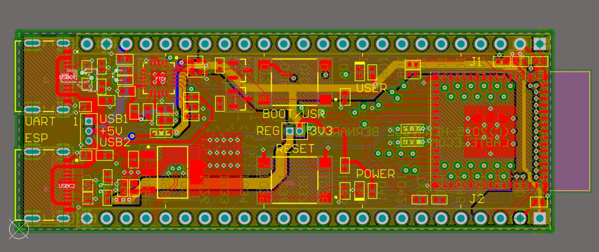
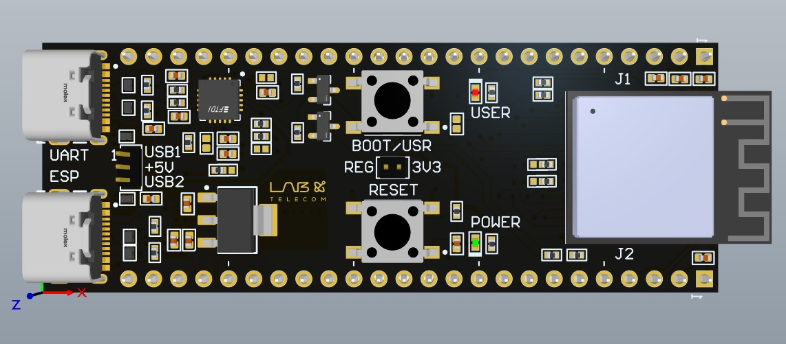
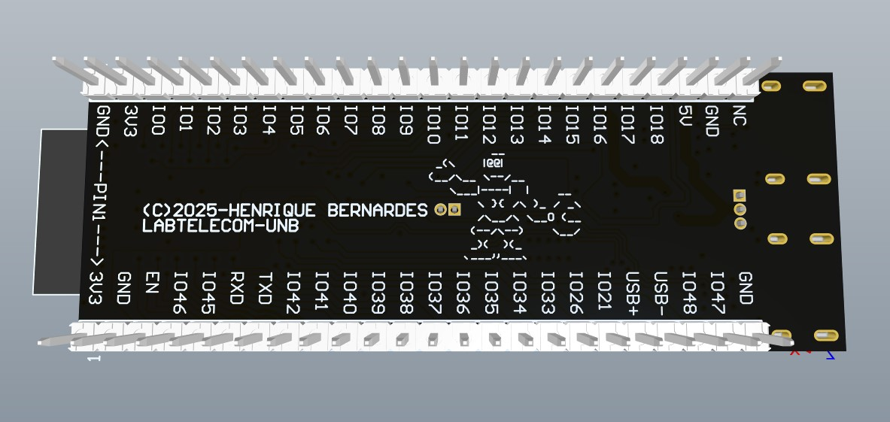

## 1MHz to 10GHz Power Meter with AD8319

This project consists of a wideband RF power meter designed around the AD8319 RF Logarithmic Detector, capable of measuring signal power across a broad frequency range from 1 MHz to 10 GHz. For this board, eletromagnetic simulations were necessary for impedance matching at the inteface between the SMA connector and the 50 Ohm track leading it to the AD8319.
The images below show some of the schematics/3D models of the board and the simulations done and the results.

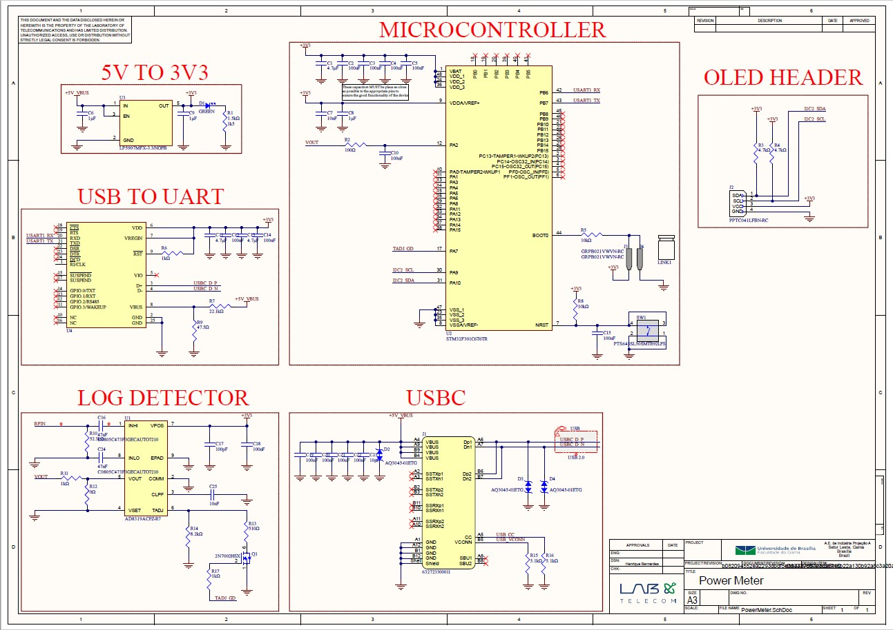
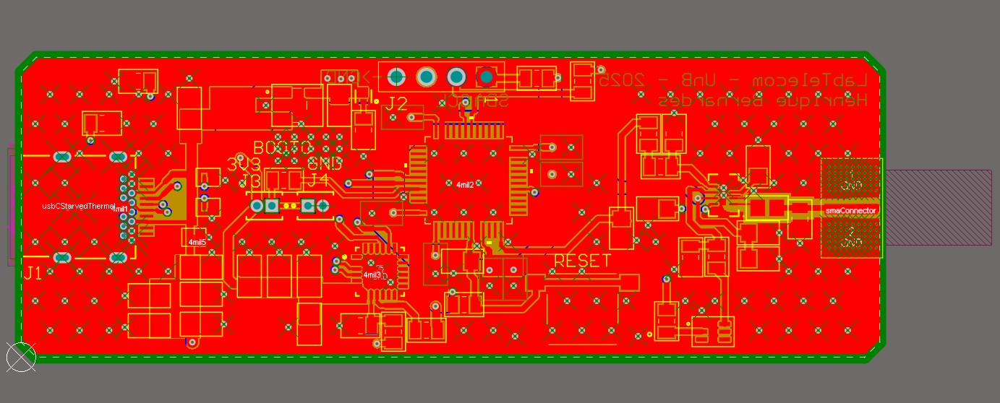
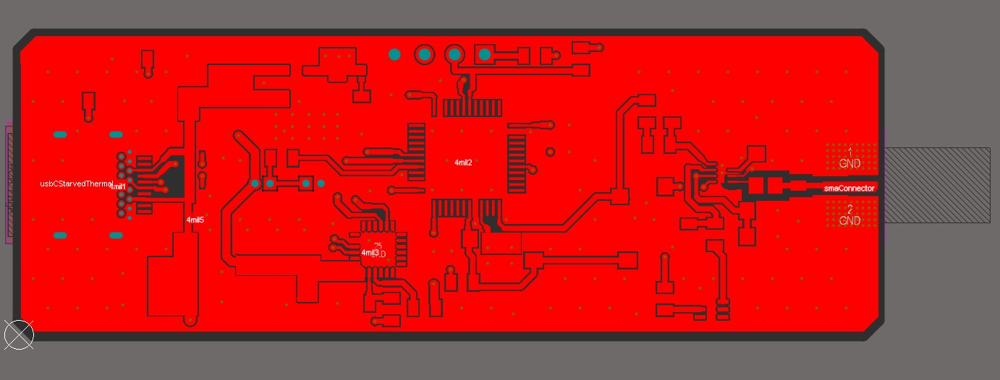
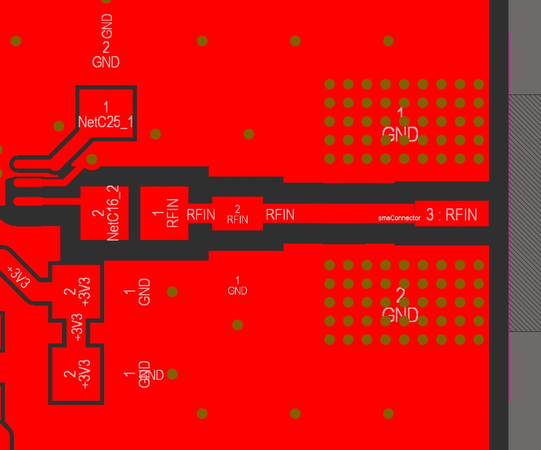
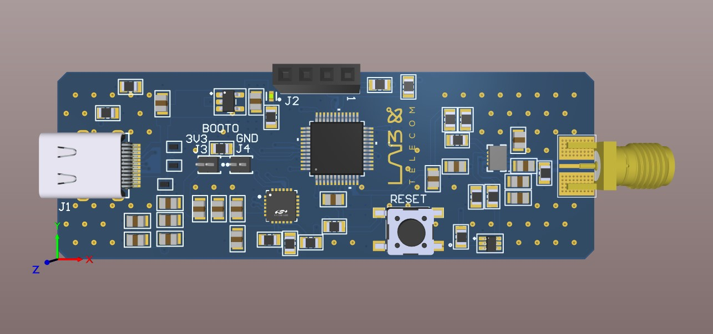
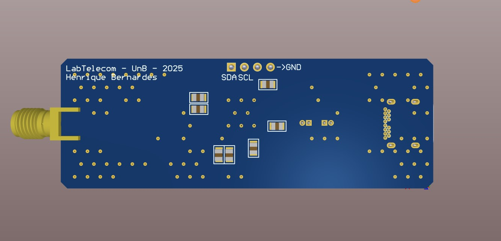
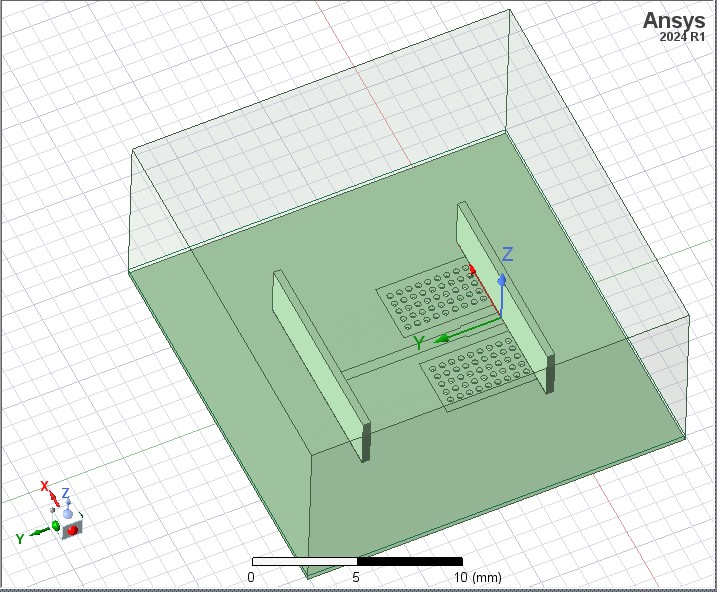

   

<!--

  

 
-->
