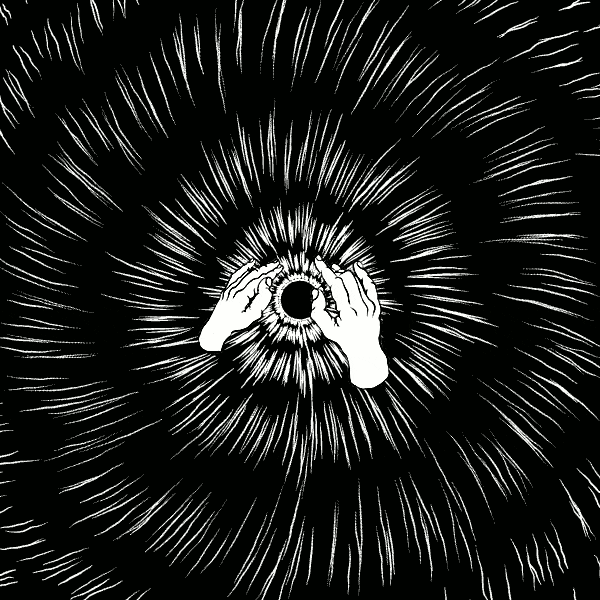

Eletronic engineering at UnB, Brazil.
Building a portfolio based on RF engineering and high frequency PCBs based on oportunities presented to me primaraly in the Telecommunications Lab in UnB. I have fundamentals in VNA analyzers, experience with PCB manufacturing with fiber laser engravers, line followers and related eletronics(Titans competition team), experience with eletromagnetic rf circuit simulation in Ansys softwares.

## A couple of things that i had my hand in: 

# ESP32 with Dual USB-C Ports

This project is an **ESP32 design** created with **Altium**.
The images below show some of the schematics/3D models of the board.

   

<!--

  

 
-->
